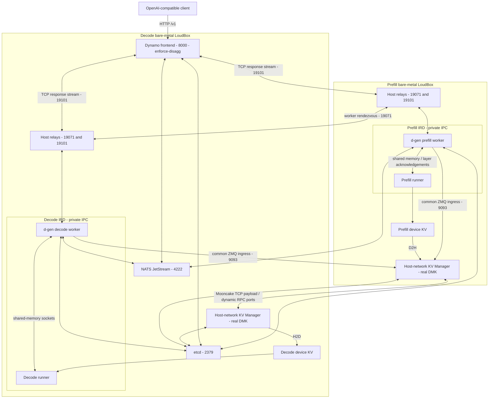

# Disaggregated serving architecture

This shows the d-gen/KV-manager request and transfer paths for a two-host IRD
deployment. Ports are examples from the [Mistral recipe](<../mistrall 4/README.md>);
its [site file](<../mistrall 4/configs/deployment.example.json>) can change them.
Device counts, model geometry, and launch settings belong to each model recipe.
Model shared memory and device KV are different paths.

Each host's KV manager opens the assigned devices for DMK movement. The model
recipe must reserve compatible device resources for compute and migration.

| Path / example port | Purpose and reachability |
|---|---|
| Decode host `8000` | Client API: `/v1/models`, `/v1/chat/completions` |
| Decode host `2379`, `4222` | etcd discovery, NATS request/event planes; reachable from both runners and KVMs |
| Decode loopback `2380` | Single-member etcd peer listener; no cross-host exposure needed |
| Prefill host `9093` | Common ZMQ migration ingress used by both workers |
| Both hosts `18650` | KVM control; distinct from worker rendezvous |
| Both hosts `18081` | KVM `/health`, `/metrics`; reachable from validator |
| Both hosts `19071` | Worker KV rendezvous; host relay into local IRD |
| Both hosts `19101` | Worker TCP response streams; needed even with NATS request/event planes |
| Runner namespace `18082` | Worker system/health listener |
| Dynamic host TCP ports | Mooncake published RPC/data listeners; fixed coordination ports alone are insufficient |
| Shared filesystem | Live KV tables/maps and shared HOME model metadata |

For native runners, remove the IRD boxes and relays: workers bind the host
directly and share host IPC with runners. For IRDs, advertise host addresses
and forward into each container. Both IRDs may be `172.17.0.2`; those belong to
separate bridges and must not be cross-host identities.

Relays avoid recreating an active IRD with new Docker `-p` mappings. Workers
still run inside the model IRD; a relay does not expose private shared memory.
Table ownership follows the runner's literal hostname; KVM advertisements use
the routable host IP. Recheck both after reservation recreation.

`DYN_SELF_HOST_METADATA=0` uses shared model metadata. Without shared storage,
follow the reachable-metadata alternative in the
[networking guide](../.agents/skills/setup-disagg/references/networking.md).
See [operations](OPERATIONS.md) for launch, inspection, validation, and teardown.
